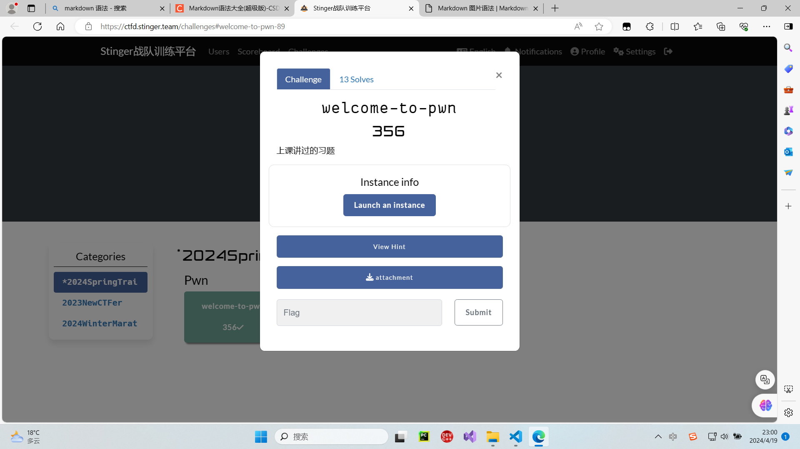

## 1：安全知识:
通过观看相应视频解答相关问题

## CRYPTO
### 用户信息访问控制
/home/player/cube-userinfo-access/instance/server/record.list  
末尾填充两条数据  
{  
	"name":"cell",  
	"isleveladjust":1,  
	"isselfdefine":0,  
	"class":0,  
	"level_fix":0,  
	"level_adjust":0   
}  
{  
	"name":"email",  
	"isleveladjust":1,  
	"isselfdefine":0,  
	"class":0,  
	"level_fix":0,  
	"level_adjust":-2  
}  

/home/player/cube-userinfo-access/src/record_acl/record_acl.c  
补全except_rule函数  
int except_rule(char * record_name,char * read_user,char * record_user)  
{  
	int ret;  
	if (strcmp(record_name, "salary") == 0 && strcmp  (read_user, record_user) == 0) {  
        return 1;  
    }  
	return 0;  
}  


终端输入export CUBEAPPPATH=/home/player/cube-userinfo-access  
cd /home/player/cube-userinfo-access/src
make clean  
make  

然后输入 sh player.sh拿到 flag  


flag{5429ed0e-b30c-42c6-b42e-85f6f1bbe7bd}


### 古典密码
拿到一串编码   AnU7NnR4NassOGp3BDJgAGonMaJayTwrBqZ3ODMoMWxgMnFdNqtdMTM9  
题目说是古典密码，于是开始尝试，尝试到仿射密码
使用脚本爆破
```python
# 暴力破解仿射密码

def decrypt():
    k1 = [1, 3, 5, 7, 9, 11, 15, 17, 19, 21, 23, 25]
    n = 1
    ny = []
    for i in k1:
        while (i * n) % 26 != 1:
            n += 1
        ny.append(n)


    cipher ='AnU7NnR4NassOGp3BDJgAGonMaJayTwrBqZ3ODMoMWxgMnFdNqtdMTM9'
    p = []
    for k1 in ny:
        for k2 in range(1, 27):
            p.append('\n 逆元=' + str(k1) + '   k2=' + str(k2) + '   ')
            # plain = ''.join('\n 逆元='+str(k1)+'k2='+str(k2)+'   ')
            for i in range(len(cipher)):
                # 小写字母
                if cipher[i].islower():
                    t1 = ord(cipher[i]) - 97 - k2
                    if t1 < 0:
                        t1 += 26
                    p.append(chr((k1 * t1) % 26 + 97))
                # 大写字母
                elif cipher[i].isupper():
                    t2 = ord(cipher[i]) - 65 - k2
                    if t2 < 0:
                        t2 += 26
                    p.append(chr((k1 * t2) % 26 + 65))
                # 其他
                else:
                    p.append(cipher[i])

            plain = ''.join(p)
    print(plain)
    print('解密完成！')


if __name__ == '__main__':
    decrypt()

```

观察解出来的东西很想base64，于是放到base64里面解密试试

末尾发现一串很像flag的东西，使用在线工具fence解密

得到flag  
flag{b2bb0873-8cae-4977-a6de-0e298f0744c3}  


## 2：MISC
### 1：大学生安全测试能力调研问卷
通过回答相关问题获取flag

flag{海纳百川，有容乃大。}

### 2：火锅链观光打卡
点进链接，获取提示，安装好Metamask。连接钱包后开始答题，答对7道题后解锁flag

flag{y0u_ar3_hotpot_K1ng}

### 3:神秘文件

## REVERSE
### 1:_asm_re
简单分析后写出代码获取
```python
buffer = [0x1fd7, 0x21b7, 0x1e47, 0x2027, 0x26e7, 0x10d7, 0x1127, 0x2007, 0x11c7, 0x1e47, 0x1017, 0x1017, 0x11f7,
 0x2007, 0x1037, 0x1107, 0x1f17, 0x10d7, 0x1017, 0x1017, 0x1f67, 0x1017, 0x11c7, 0x11c7, 0x1017, 0x1fd7,
 0x1f17, 0x1107, 0x0f47, 0x1127, 0x1037, 0x1e47, 0x1037, 0x1fd7, 0x1107, 0x1fd7, 0x1107, 0x2787
]

for i in range(len(buffer)):
 print(chr((((buffer[i] - 0x1e) ^ ord('M')) - 0x14) // ord('P')), end="")

```

flag{67e9a228e45b622c2992fb5174a4f5f5}
